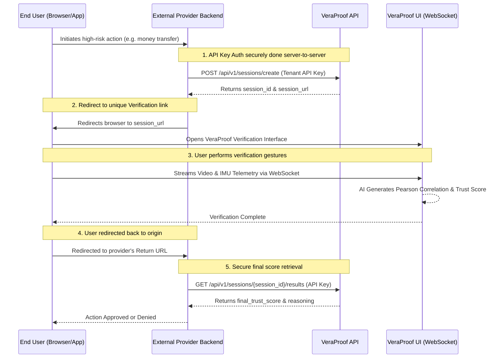

# VeraProof AI — API-First External Integration Workflow

VeraProof AI is designed from the ground up as an API-first verification platform. It allows external service providers (e.g., banks, dating apps, gig economy platforms) to seamlessly embed enterprise-grade biometric verification and AI forensics into their own applications.

## Integration Architecture

The interaction flow between an External Provider ("Tenant"), their End User, and the VeraProof verification engine follows a standard OAuth-like redirect loop.

## Security Posture

### 1. Verification Sandboxing
The external provider never interacts directly with the biometric processing pipeline. All heavy lifting—facial tracking, video processing, and optical flow measurements—occur within VeraProof's stateless containers.

### 2. The IMU Telemetry (Sensor Fusion)
During the verification UI phase, the user's mobile device continuously records telemetry from its Inertial Measurement Unit (IMU). Specifically, VeraProof captures standard HTML5 DeviceMotionEvent streams (accelerometer and gyroscope vectors).

VeraProof mitigates Deepfakes and Camera-Injection attacks via **Sensor Fusion Analysis**.
- As the user physically moves their phone in a pan-right/pan-left motion, the IMU records real-time rotational velocity.
- The backend AI extracts facial optical-flow vectors from the video chunks.
- The two streams are correlated. A mathematically generated video (deepfake) injected into a webcam driver will not have corresponding real-world physical IMU gyroscope movement matching the visual movement.
- True humans generate high Pearson correlation (~0.90+) between the device's gyro sensors and the video's optical flow.

### 3. State Trust 
At step #4, when the user is redirected back to the External Provider, they often include a success status in the URL parameters. **The external provider should never trust client-side parameters.** They must use their backend API key to securely query Step #5 (`GET /sessions/{session_id}/results`) to fetch the authentic, untamperable `final_trust_score`.
